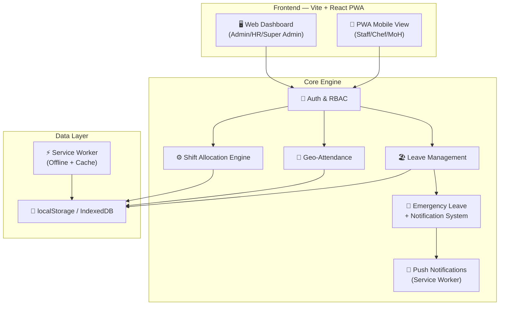
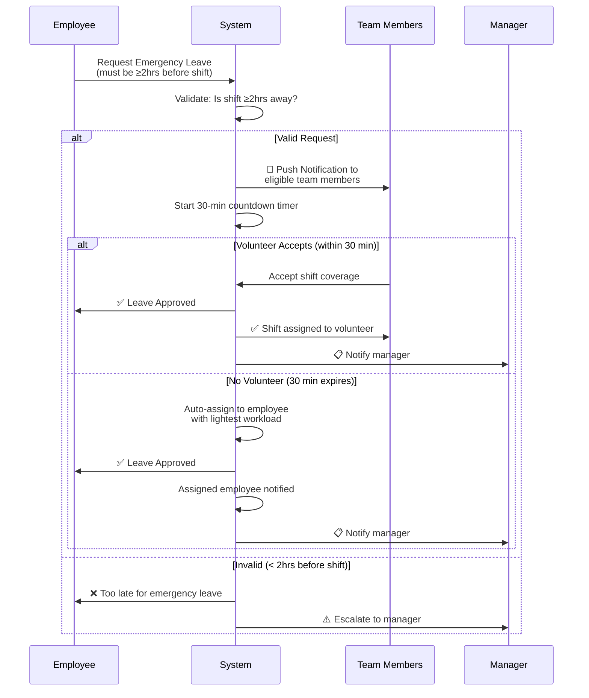

# Shiftly — CRM + Shift Management Web App & PWA

A full-stack shift management and CRM system with intelligent auto-allocation, geo-fenced attendance, emergency leave workflows, and a PWA-ready mobile experience.

---

## User Review Required

> [!IMPORTANT]
> **Tech Stack Decision**: This plan uses **Vite + React** (no backend server — all data is stored in **localStorage/IndexedDB** for the demo). For a production version, you'd add a Node.js/Express backend with PostgreSQL. This approach lets us build the full UI + logic immediately without database setup overhead. Confirm if this is acceptable, or if you want a full backend from the start.

> [!IMPORTANT]
> **PWA APK Generation**: The PWA will be installable on Android via "Add to Home Screen" or can be packaged as an APK using [Bubblewrap/PWABuilder](https://www.pwabuilder.com/). The app itself will be built as a responsive PWA that works on both web and mobile.

> [!WARNING]
> **Geolocation Attendance** requires HTTPS in production. During local dev, `localhost` is treated as a secure context so it will work.

---

## Open Questions

> [!IMPORTANT]
> 1. **Location Coordinates**: What are the specific venue/restaurant GPS coordinates and allowed radius (e.g., 100m, 200m) for geo-fenced attendance? I'll use a configurable default (100m radius) that admins can set.
> 2. **Shift Types**: What are the standard shift slots? (e.g., Morning 6AM-2PM, Afternoon 2PM-10PM, Night 10PM-6AM)? I'll create configurable shift templates.
> 3. **Number of Departments/Venues**: Is this for a single venue or multi-venue? I'll build for multi-venue support.
> 4. **Emergency Leave — 30-min acceptance window**: After 30 mins with no volunteer, should the system auto-assign to the employee with the lightest workload, or should it escalate to a manager?

---

## Architecture Overview



---

## Proposed Changes

### 1. Project Scaffold & Configuration

#### [NEW] Project initialization via Vite + React

- `npx create-vite` with React + JavaScript template
- Install dependencies: `react-router-dom`, `lucide-react`, `date-fns`
- Configure PWA manifest, service worker, icons

#### [NEW] [vite.config.js](file:///Users/rituraj/Downloads/KG/Shiftly%20BK/vite.config.js)
- Vite configuration with PWA plugin (`vite-plugin-pwa`)
- Service worker registration for offline support

#### [NEW] [public/manifest.json](file:///Users/rituraj/Downloads/KG/Shiftly%20BK/public/manifest.json)
- PWA manifest with app name, icons, theme colors, display mode `standalone`

#### [NEW] [public/sw.js](file:///Users/rituraj/Downloads/KG/Shiftly%20BK/public/sw.js)
- Service worker for caching, offline support, and push notification handling

---

### 2. Design System & Styling

#### [NEW] [src/index.css](file:///Users/rituraj/Downloads/KG/Shiftly%20BK/src/index.css)
- Complete design system with CSS custom properties
- Dark mode support with glassmorphism aesthetic
- Color palette: Deep indigo/violet primary, emerald accents, warm amber warnings
- Typography: Inter font from Google Fonts
- Responsive breakpoints for mobile-first design
- Micro-animations and transitions

---

### 3. Authentication & Role-Based Access Control

#### [NEW] [src/contexts/AuthContext.jsx](file:///Users/rituraj/Downloads/KG/Shiftly%20BK/src/contexts/AuthContext.jsx)
- Auth context with login/logout
- Role-based permissions matrix:

| Feature | Super Admin | Admin | HR | Master of House | Head Chef |
|---|---|---|---|---|---|
| All Settings | ✅ | ❌ | ❌ | ❌ | ❌ |
| Manage Admins | ✅ | ❌ | ❌ | ❌ | ❌ |
| Employee CRUD | ✅ | ✅ | ✅ | ❌ | ❌ |
| Shift Management | ✅ | ✅ | ✅ | ✅ | ✅ |
| View All Shifts | ✅ | ✅ | ✅ | ✅ | ✅ |
| Approve Leave | ✅ | ✅ | ✅ | ✅ | ✅ |
| Attendance Reports | ✅ | ✅ | ✅ | ✅ | ❌ |
| Own Attendance | ✅ | ✅ | ✅ | ✅ | ✅ |
| Emergency Leave | ✅ | ✅ | ✅ | ✅ | ✅ |

#### [NEW] [src/pages/LoginPage.jsx](file:///Users/rituraj/Downloads/KG/Shiftly%20BK/src/pages/LoginPage.jsx)
- Premium login page with animated gradient background
- Role-based demo accounts for quick testing

---

### 4. Core Data & State Management

#### [NEW] [src/store/dataStore.js](file:///Users/rituraj/Downloads/KG/Shiftly%20BK/src/store/dataStore.js)
- Central data store using localStorage with reactive hooks
- Data models:
  - **Employees**: id, name, email, phone, role, department, skills, availability, avatar
  - **Shifts**: id, date, startTime, endTime, type, assignedTo, department, status
  - **Attendance**: id, employeeId, date, checkIn, checkOut, location, status
  - **Leaves**: id, employeeId, type, startDate, endDate, status, reason, isEmergency
  - **Notifications**: id, to, from, type, message, status, createdAt, expiresAt
  - **Venues**: id, name, latitude, longitude, radius

#### [NEW] [src/store/seedData.js](file:///Users/rituraj/Downloads/KG/Shiftly%20BK/src/store/seedData.js)
- Realistic demo data: 25+ employees, shifts for current week, sample attendance records

---

### 5. Shift Allocation Engine

#### [NEW] [src/engine/shiftAllocator.js](file:///Users/rituraj/Downloads/KG/Shiftly%20BK/src/engine/shiftAllocator.js)

**Rule-Based Auto-Allocation Algorithm:**

```
1. FORECAST demand based on:
   - Day of week patterns (weekends need more staff)
   - Historical attendance data
   - Current leave schedule

2. SCORE each available employee:
   - Skill match for shift type (+30 points)
   - Historical reliability (attendance %) (+25 points)
   - Hours worked this week (inverse — less = higher score) (+20 points)
   - Employee preference/availability (+15 points)
   - Consecutive days worked (penalize > 5 days) (-10 points)
   - Last shift gap (must be ≥ 8 hours) (HARD CONSTRAINT)

3. ALLOCATE using greedy assignment:
   - Sort employees by score (descending)
   - Assign top-scored employee to each open slot
   - Respect hard constraints (max hours, rest period, skills)
   
4. REBALANCE:
   - Check fairness across the week
   - Swap assignments if one employee is overloaded
```

---

### 6. Geo-Fenced Attendance System

#### [NEW] [src/engine/geoAttendance.js](file:///Users/rituraj/Downloads/KG/Shiftly%20BK/src/engine/geoAttendance.js)
- Haversine formula for distance calculation
- Configurable geofence radius per venue
- Check-in/check-out with GPS validation
- Anti-spoofing: timestamp + device fingerprint logging

#### [NEW] [src/pages/AttendancePage.jsx](file:///Users/rituraj/Downloads/KG/Shiftly%20BK/src/pages/AttendancePage.jsx)
- **Admin View**: Attendance dashboard with daily/weekly/monthly views, maps
- **Employee View**: Check-in/out button with location status indicator
- Real-time distance display from venue

---

### 7. Leave Management System

#### [NEW] [src/engine/leaveManager.js](file:///Users/rituraj/Downloads/KG/Shiftly%20BK/src/engine/leaveManager.js)
- Leave request workflow (apply → approve/reject)
- Auto-trigger shift reallocation when leave is approved
- Leave balance tracking (casual, sick, earned, emergency)
- Calendar conflict detection

#### [NEW] [src/engine/emergencyLeave.js](file:///Users/rituraj/Downloads/KG/Shiftly%20BK/src/engine/emergencyLeave.js)

**Emergency Leave Workflow:**


---

### 8. Notification System

#### [NEW] [src/engine/notificationEngine.js](file:///Users/rituraj/Downloads/KG/Shiftly%20BK/src/engine/notificationEngine.js)
- In-app notification center with badge counts
- Push notification support via Service Worker
- Notification types: shift assignment, emergency cover request, leave approval, attendance reminder
- 30-minute countdown timer for emergency requests

---

### 9. Web Dashboard Pages (Admin/HR View)

#### [NEW] [src/pages/DashboardPage.jsx](file:///Users/rituraj/Downloads/KG/Shiftly%20BK/src/pages/DashboardPage.jsx)
- KPI cards: Today's attendance %, open shifts, pending leaves, active emergencies
- Weekly shift coverage chart
- Recent activity feed
- Quick actions panel

#### [NEW] [src/pages/EmployeesPage.jsx](file:///Users/rituraj/Downloads/KG/Shiftly%20BK/src/pages/EmployeesPage.jsx)
- Employee directory with search, filter by role/department
- Add/edit employee profiles with avatar, skills, contact info
- Employee detail view with shift history, attendance record, leave balance

#### [NEW] [src/pages/ShiftsPage.jsx](file:///Users/rituraj/Downloads/KG/Shiftly%20BK/src/pages/ShiftsPage.jsx)
- Weekly calendar view (drag-and-drop style display)
- Auto-allocate button with algorithm preview
- Manual override capability
- Shift templates management
- Color-coded by department/shift type

#### [NEW] [src/pages/LeavesPage.jsx](file:///Users/rituraj/Downloads/KG/Shiftly%20BK/src/pages/LeavesPage.jsx)
- Leave requests queue with approve/reject actions
- Team calendar showing leave overlaps
- Leave balance summary per employee
- Emergency leave section with live countdown timers

#### [NEW] [src/pages/ReportsPage.jsx](file:///Users/rituraj/Downloads/KG/Shiftly%20BK/src/pages/ReportsPage.jsx)
- Attendance reports with export
- Shift coverage analytics
- Leave utilization charts
- Employee performance metrics

#### [NEW] [src/pages/SettingsPage.jsx](file:///Users/rituraj/Downloads/KG/Shiftly%20BK/src/pages/SettingsPage.jsx)
- Venue/location management (set geofence coordinates)
- Shift template configuration
- Role management
- System preferences

---

### 10. PWA Mobile View (Staff View)

#### [NEW] [src/pages/mobile/MobileDashboard.jsx](file:///Users/rituraj/Downloads/KG/Shiftly%20BK/src/pages/mobile/MobileDashboard.jsx)
- Today's shift card with countdown
- Quick check-in/out button (big, prominent)
- Upcoming shifts preview
- Notification bell with badge

#### [NEW] [src/pages/mobile/MobileShifts.jsx](file:///Users/rituraj/Downloads/KG/Shiftly%20BK/src/pages/mobile/MobileShifts.jsx)
- My shifts list view (this week/next week)
- Shift swap requests
- Accept/decline shift coverage

#### [NEW] [src/pages/mobile/MobileLeave.jsx](file:///Users/rituraj/Downloads/KG/Shiftly%20BK/src/pages/mobile/MobileLeave.jsx)
- Apply for leave (regular/emergency)
- Emergency leave with 2-hour validation
- Leave balance display
- Leave history

#### [NEW] [src/pages/mobile/MobileProfile.jsx](file:///Users/rituraj/Downloads/KG/Shiftly%20BK/src/pages/mobile/MobileProfile.jsx)
- Personal profile view/edit
- Availability preferences
- Notification settings

---

### 11. Shared Components

#### [NEW] [src/components/](file:///Users/rituraj/Downloads/KG/Shiftly%20BK/src/components/)
- `Sidebar.jsx` — Collapsible navigation with role-based menu items
- `Header.jsx` — Top bar with notifications, user avatar, search
- `MobileNav.jsx` — Bottom tab navigation for PWA mobile view
- `ShiftCard.jsx` — Reusable shift display card
- `EmployeeCard.jsx` — Employee profile card
- `NotificationPanel.jsx` — Slide-out notification drawer
- `Modal.jsx` — Reusable modal component
- `Badge.jsx`, `Button.jsx`, `Input.jsx` — UI primitives
- `LocationMap.jsx` — Visual map showing geofence zone
- `CountdownTimer.jsx` — 30-min emergency leave countdown
- `StatsCard.jsx` — Dashboard KPI card with animations

---

### 12. Routing & Layout

#### [NEW] [src/App.jsx](file:///Users/rituraj/Downloads/KG/Shiftly%20BK/src/App.jsx)
- React Router with protected routes
- Responsive layout detection (web vs mobile breakpoint)
- Auto-redirect based on user role:
  - Super Admin / Admin / HR → Web Dashboard
  - Master of House / Head Chef → Mobile-first view (can access web)

---

## File Structure

```
Shiftly BK/
├── public/
│   ├── manifest.json          # PWA manifest
│   ├── sw.js                  # Service worker
│   ├── icons/                 # PWA icons (192x192, 512x512)
│   └── index.html
├── src/
│   ├── index.css              # Design system + global styles
│   ├── main.jsx               # Entry point
│   ├── App.jsx                # Router + layouts
│   ├── contexts/
│   │   └── AuthContext.jsx    # Auth + RBAC
│   ├── store/
│   │   ├── dataStore.js       # Data layer (localStorage)
│   │   └── seedData.js        # Demo data
│   ├── engine/
│   │   ├── shiftAllocator.js  # Auto shift allocation
│   │   ├── geoAttendance.js   # Geofenced attendance
│   │   ├── leaveManager.js    # Leave workflows
│   │   ├── emergencyLeave.js  # Emergency leave engine
│   │   └── notificationEngine.js # Notifications
│   ├── components/
│   │   ├── Sidebar.jsx
│   │   ├── Header.jsx
│   │   ├── MobileNav.jsx
│   │   ├── ShiftCard.jsx
│   │   ├── Modal.jsx
│   │   └── ...
│   ├── pages/
│   │   ├── LoginPage.jsx
│   │   ├── DashboardPage.jsx
│   │   ├── EmployeesPage.jsx
│   │   ├── ShiftsPage.jsx
│   │   ├── AttendancePage.jsx
│   │   ├── LeavesPage.jsx
│   │   ├── ReportsPage.jsx
│   │   ├── SettingsPage.jsx
│   │   └── mobile/
│   │       ├── MobileDashboard.jsx
│   │       ├── MobileShifts.jsx
│   │       ├── MobileLeave.jsx
│   │       └── MobileProfile.jsx
│   └── utils/
│       ├── constants.js       # Roles, shift types, etc.
│       └── helpers.js         # Date formatting, etc.
├── package.json
└── vite.config.js
```

---

## Verification Plan

### Automated Tests
- Run `npm run build` to verify no compilation errors
- Run the dev server `npm run dev` and verify all routes load

### Manual Verification
1. **Login Flow**: Test login with each of the 5 roles and verify correct dashboard/permissions
2. **Shift Allocation**: Click "Auto Allocate" and verify the algorithm distributes shifts fairly
3. **Geo-Attendance**: Test check-in from browser (allow location) — verify distance calculation
4. **Leave Flow**: Submit a leave request → verify shift reallocation triggers
5. **Emergency Leave**: Trigger emergency leave → verify 30-min timer and notification broadcast
6. **PWA Install**: Open in Chrome mobile → verify "Add to Home Screen" prompt works
7. **Responsive Design**: Test at 375px (mobile), 768px (tablet), 1440px (desktop)

---

## Estimated Scope

| Component | Files | Complexity |
|---|---|---|
| Project Setup & PWA Config | 5 | Low |
| Design System (CSS) | 1 | Medium |
| Auth & RBAC | 2 | Medium |
| Data Store & Seed Data | 2 | Medium |
| Shift Engine | 1 | High |
| Geo-Attendance Engine | 1 | Medium |
| Leave & Emergency Engine | 2 | High |
| Notification Engine | 1 | Medium |
| Web Dashboard Pages (7) | 7 | High |
| Mobile PWA Pages (4) | 4 | Medium |
| Shared Components (12+) | 12 | Medium |
| Routing & Layout | 1 | Low |
| **Total** | **~39 files** | — |
